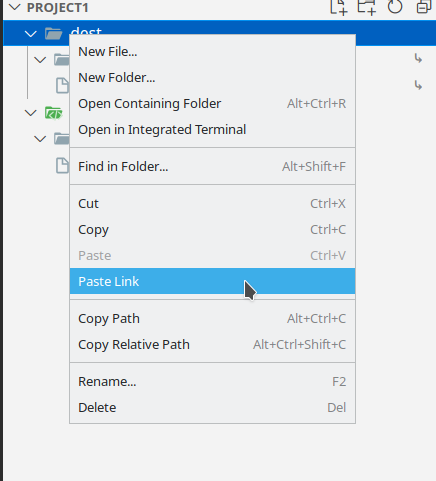

The extension allows you to create relative symlinks directly from File Explorer

To support this extension on **VS Code Server**, please install [Copy Link Companion](https://marketplace.visualstudio.com/items?itemName=rkhat.copy-link-companion)

## Usage

Copy any files and/or directories from the File Explorer.

Right Click any target directory and click **Paste Link** to create a relative symlink of the copied files in the target directory. The copied files must be in the same workspace of the target directory.

## Known Issues

* The target directory does not expand after pasting the link.

* Mac and Windows hosts are not supported.

* Keybinding does not work. A limitation by VScode:

https://github.com/microsoft/vscode/issues/3553
